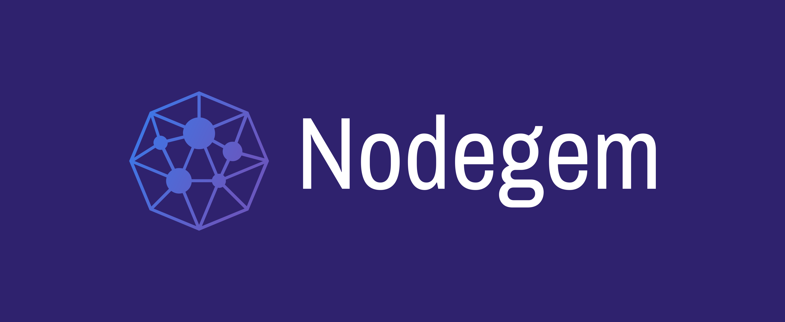

# Welcome to Nodegem!

[Nodegem](https://www.nodegem.io/) is a **visual scripting tool** meant for all kinds of automation projects without the need to know how to program. It is designed to be as inviting as possible to any and all kinds of people varying from no knowledge of programming to expert programmers. The plan is to have all sorts of integrations from many different sources and to be community driven.

**Project Link**: [https://gitlab.com/nodegem](https://gitlab.com/nodegem)

## Disclaimer!!

This is very much a WIP and some scripts, code, etc might be broken. If you find something please refer to   
the [Known Issues](basics/known-issues.md) page first and if what you are experiencing is not on the list then add it to the issues page.

## Discord Invite



