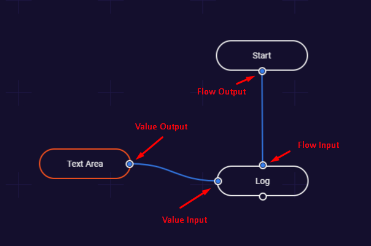

# Nodes

## What is it?

These are the basic building blocks you use in building your graphs and macros. Nodes consist of ports which are meant to represent inputs and outputs except the inputs and outputs aren't always values. This is where **flow** ports come in. They are there to represent, well, the _flow_ of the program.

## Flow

Flows move from a top down approach. If you look at the example above you will see that the `Start` is at the top of the graph and the actions happen below it. It's a more intuitive approach to reading and understanding what is happening inside the graph just like how _most_ people read from top to bottom of a page.  
  
\* Flow ports can only connect to other flow ports  
\* Flow outputs **cannot** be connected to multiple flow inputs

## Value

Value ports are represents from a left to right approach. They hold the actual values within the nodes, so pretty much the meat and bones of the program.  
  
\* Value ports can only connect to other value ports  
\* Value outputs can be connected to **multiple** value input ports

